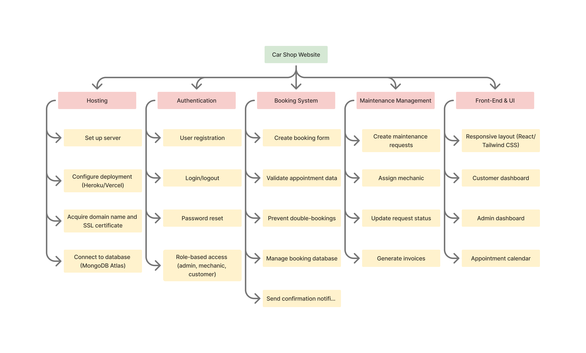

# Project Charter

### Car Shop Website

---

## 1. Introduction

This project aims to design and develop a full-featured **Car Shop Website** that simplifies interactions between customers and the shop. The platform will allow customers to book appointments, request maintenance, view their service history, and communicate directly with staff. On the administrative side, the system will enable staff to manage appointments, view inventory, assign jobs to mechanics, and track ongoing maintenance requests. The goal is to modernize the workflow of small and medium-sized car shops by providing an efficient and user-friendly digital system.

---

## 2. Overview (including Objectives)

### Project Overview

Many car shops still rely on phone calls, paper-based systems, and manual scheduling to manage daily operations. This often leads to scheduling conflicts, delays, and poor customer experience. The **Car Shop Website** will streamline these processes through an integrated online solution.

### Objectives

- Provide customers with the ability to **book, view, and manage appointments** online.
- Enable administrators to **manage appointments and staff schedules** effectively.
- Allow mechanics to **view assigned jobs and update their completion status**.
- Securely store and manage **customer and vehicle information**.
- Improve communication between customers, staff, and management through notifications and updates.

---

## 3. Milestones

| #   | Milestone                   | Description                                                                    | Target Date |
| --- | --------------------------- | ------------------------------------------------------------------------------ | ----------- |
| 1   | Project Setup               | Repository creation, team setup, and project charter draft submission          | Week 1      |
| 2   | Back-End API Development    | Develop core endpoints for booking, authentication, and maintenance management | Week 3      |
| 3   | Database Integration        | Implement MongoDB schema for appointments, customers, and inventory            | Week 4      |
| 4   | Front-End Interface         | Build responsive pages for customer and admin views                            | Week 5      |
| 5   | System Testing & Deployment | Conduct integration testing, finalize documentation, and deploy final version  | Week 6      |

### 3.1 Work Breakdown Structure

### 3.2 Requirements Traceability Matrix

| Req ID | Requirement                                                                    | Del ID | Deliverable                                                                                                        | Owner                      | Status      |
| ------ | ------------------------------------------------------------------------------ | ------ | ------------------------------------------------------------------------------------------------------------------ | -------------------------- | ----------- |
| REQ01  | Hosting environment configured and connected to MongoDB                        | DEL01  | Server and database deployed successfully                                                                          | Vadim (Back-End Dev)       | In Progress |
| REQ02  | Booking system allows customers to book, edit, and cancel appointments         | DEL02  | Functional booking module with API endpoints                                                                       | Vadim (Back-End Dev)       | In Progress |
| REQ03  | Admins can check appointment requests, confirm bookings, and assign mechanics. | DEL03  | Admin maintenance assignment page                                                                                  | Naoko (Database/Front-End) | In Progress |
| REQ04  | Responsive UI design system and shared component library                       | DEL04  | Production‑ready React/Tailwind component library with a documented style guide                                    | Thai(UI/UX Designer)       | In Progress |
| REQ05  | End‑to‑end UX for booking and admin workflows (dashboards + calendar)          | DEL05  | Customer and Admin dashboards with appointment calendar, validated forms, notifications, and usability test report | Thai(UI/UX Designer)       | In Progress |
| REQ06  | Users can sign up, log in, and log out securely using email and passsword authentication | DEL06 | Functional Log In/ Sign Up screens that validate the user | Rianna (Front End Dev) | In Progress |

---

## 4. Deliverables

| #   | Deliverable                   | Description                                                                                 |
| --- | ----------------------------- | ------------------------------------------------------------------------------------------- |
| 1   | `README.md`                   | Overview of the project, team members, and technology stack.                                |
| 2   | `project_charter.md`          | Initial project charter including objectives, milestones, and deliverables.                 |
| 3   | `WORKING_AGREEMENT.md`        | Team collaboration rules and responsibilities.                                              |
| 4   | Back-End API                  | Functional Node.js/Express.js API for bookings, authentication, and maintenance management. |
| 5   | Front-End Application         | React interface for customers, admins, and mechanics to access system features.             |
| 6   | Database Schema               | Implemented MongoDB collections and models for appointments, users, and inventory.          |
| 7   | Final Report and Presentation | Documentation and presentation summarizing the system and results.                          |

---

## 5. Preliminary Budget

_(To be completed in later workshops.)_

---

## 6. Organization and Stakeholders

_(To be completed in later workshops.)_

---

## 7. Risks, Assumptions, and Constraints

_(To be completed in later workshops.)_

---
